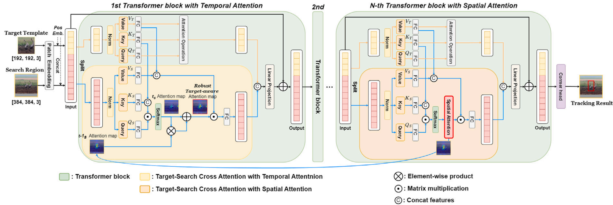

# Unified spatio-temporal attention mixformer for visual object tracking

## Introduction
This repository is the official implementation of our paper "Unified spatio-temporal attention mixformer for visual object tracking, **Engineering Applications of Artificial Intelligence, 2024**". Our code is based on [MixFormer](https://github.com/MCG-NJU/MixFormer).


<p align="center">

</p>

## Install the environment

* Create an environment for USTAM
```
conda create -n ustam_env python==3.8.3 -y
conda activate ustam_env
bash install_pytorch17.sh
```
## Data Preparation
Put the tracking datasets in ./data. It should look like:
   ```
   ${USTAM_ROOT}
    -- data
        -- lasot
            |-- airplane
            |-- basketball
            |-- bear
            ...
        -- got10k
            |-- test
            |-- train
            |-- val
        -- coco
            |-- annotations
            |-- train2017
        -- trackingnet
            |-- TRAIN_0
            |-- TRAIN_1
            ...
            |-- TRAIN_11
            |-- TEST
   ```
## Set project paths
Run the following command to set paths for this project
```
python tracking/create_default_local_file.py --workspace_dir . --data_dir ./data --save_dir .
```
After running this command, you can also modify paths by editing these two files
```
lib/train/admin/local.py  # paths about training
lib/test/evaluation/local.py  # paths about testing
```

## Train USTAM
Training with multiple GPUs using DDP. More details of 
training settings can be found at ```tracking/train_ustam_vit.sh``` .
```
# USTAM with ViT backbone
bash tracking/train_ustam_vit.sh
```

## Test and evaluate USTAM on benchmarks

- LaSOT/GOT10k-test/TrackingNet. More details of 
test settings can be found at ```tracking/test_ustam_vit.sh```
```
bash tracking/test_ustam_vit.sh
```

## Compute FLOPs/Params and test speed
```
bash tracking/profile_ustam.sh
```

## Contact
Minho Park: qkdkralsgh12@gmail.com 
